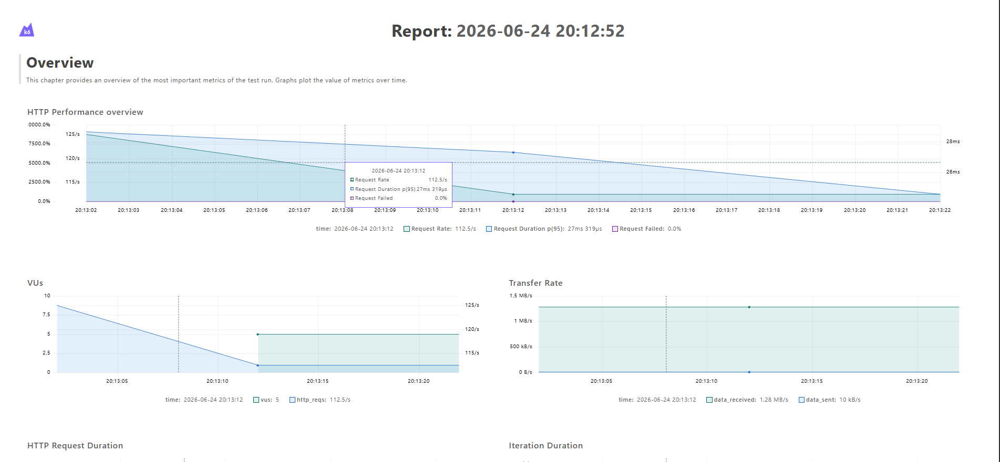
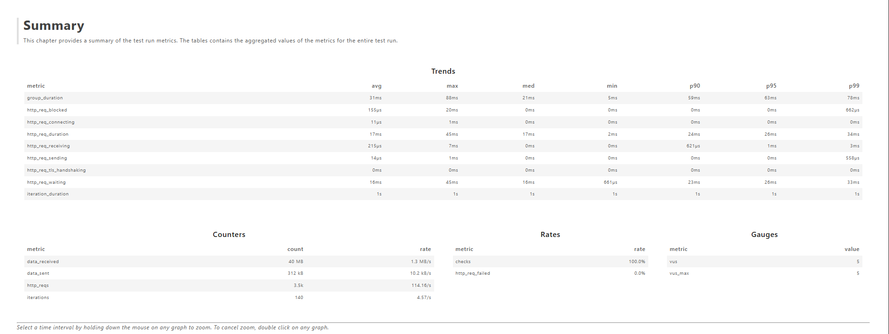
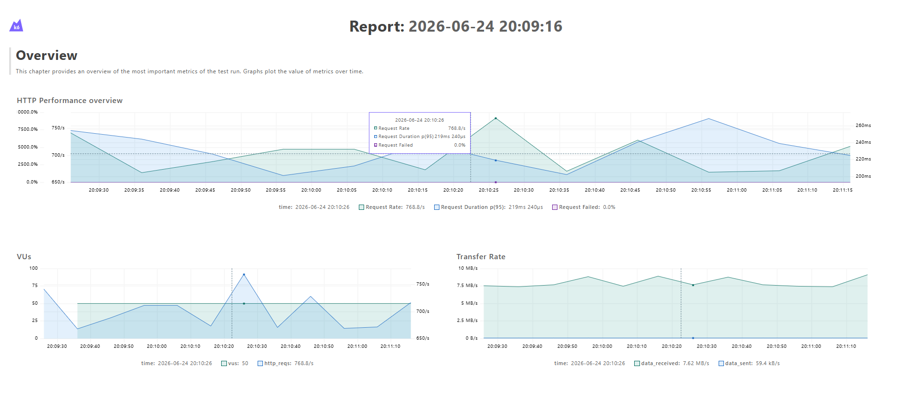
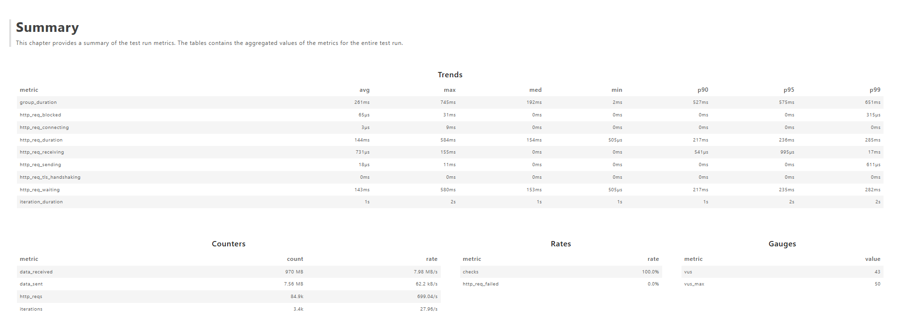

# WAT Projektarbeit

Smart card counter - Eine smarter intuitiver Spielblock für ein Wizard ähnliches Kartenspiel (Javascript)
Zusammenarbeit von Jonas Blehrmühlhuber, Nina KÖck

## Webanwendung

Bei der getesteten Anwendung handelt es sich um **Smart Card Counter** (auch „Stich Zähler"), eine Progressive Web App (PWA) zur digitalen Stichverwaltung beim Kartenspiel "Auffi owe". Die App läuft vollständig im Browser ohne jegliches Backend – der gesamte Spielstand wird ausschließlich im `localStorage` des Browsers gespeichert.

Der typische Ablauf sieht so aus: Zuerst werden Spieler angelegt und in der gewünschten Reihenfolge angeordnet. Dann läuft das Spiel über 13 Runden, wobei die Kartenanzahl der Sequenz `[1,2,3,4,5,6,7,6,5,4,3,2,1]` folgt. Pro Runde gibt es zwei Phasen: In der Ansage-Phase tippt jeder Spieler, wie viele Stiche er machen wird. In der Stiche-Phase wird eingetragen, wie viele Stiche tatsächlich gemacht wurden – wobei die Summe aller Stiche genau der ausgeteilten Kartenanzahl entsprechen muss. Die Punkteberechnung erfolgt automatisch: korrekte Ansage ergibt 5 Bonuspunkte plus die Stichanzahl, eine falsche Ansage ergibt Minuspunkte in Höhe der Differenz. Am Ende erscheint ein Podium mit dem Endstand.

Die App unterstützt außerdem automatisches Weiterspielen nach einem Browser-Neustart (Game Recovery), einen Bearbeitungsmodus für vergangene Runden mit Neuberechnung aller Folgewerte sowie eine Auto-Fill-Funktion für den letzten verbleibenden Spieler.

Die Architektur folgt einem MVC-Muster: `GameModel` (zentraler Zustand + localStorage), `GameView` mit Unterkomponenten (`SetupView`, `GameTableView`, `InputModal`, `FeedbackModals`) und drei Controller (`AppController`, `SetupController`, `RoundController`). Die Kommunikation zwischen den Schichten erfolgt über einen zentralen `EventBus`.

---

## Test Setup

### Test-Framework

Als Test-Framework verwenden wir **Jest** (v30). Die Wahl fiel auf Jest, weil wir es aus der Übung schon kennen, ohne viel Konfigurationsaufwand einsetzbar ist und eine eingebaute Code-Coverage-Analyse mitbringt.

Da die Anwendung native ES-Module (`import`/`export`) verwendet und kein Build-Tool einsetzt, wird Jest direkt über Node mit dem Flag `--experimental-vm-modules` gestartet – ein Babel-Transform ist dadurch nicht nötig. Der Testbefehl in `package.json` lautet:

```
node --experimental-vm-modules --disable-warning=ExperimentalWarning node_modules/jest/bin/jest.js
```

Für Integrationstests, die auf DOM-Elemente zugreifen müssen, verwenden wir zusätzlich das Paket **`jest-environment-jsdom`**. Es simuliert eine Browser-Umgebung inklusive `document`, `window` und `localStorage` innerhalb von Node, ohne dass ein echter Browser gestartet werden muss.

Für die System/E2E-Tests wurde **Playwright** eingesetzt, da es echte Browser (Chromium, Firefox, WebKit) steuert und somit das einzige Framework ist, mit dem sich Service Worker, Drag-and-Drop und PWA-Features wirklich testen lassen.

Für die Load-Tests haben wir **k6** ausgesucht, da es skriptbasiert, CI-freundlich und in JavaScript geschrieben ist.

### Konfiguration

Die Jest-Konfiguration liegt in `jest.config.js`:

```js
import { defaults } from 'jest-config';

const config = {
  collectCoverage: true,
  transform: {},
  testPathIgnorePatterns: [
    ...defaults.testPathIgnorePatterns,
    "/tests/node",
    "/tests/e2e"
  ]
};

export default config;
```

`transform: {}` deaktiviert jegliche Code-Transformation und erlaubt so den direkten Einsatz nativer ES-Module. `collectCoverage: true` sorgt dafür, dass nach jedem Testlauf automatisch ein Coverage-Report ausgegeben wird.

### Test-Isolation

**Unit Tests** laufen in der Standard-`node`-Umgebung ohne DOM. Jeder Test baut sich sein eigenes minimales State-Objekt und ist vollständig unabhängig von anderen Tests. Es gibt keine gemeinsamen Variablen zwischen Tests.

**Integrationstests** laufen in der `jsdom`-Umgebung, die per Docblock am Anfang der Datei aktiviert wird:

```js
/**
 * @jest-environment jsdom
 */
```

In einem `beforeEach`-Hook wird `localStorage.clear()` aufgerufen und das DOM per `document.body.innerHTML` komplett neu aufgebaut. So trägt kein Test seinen Zustand in den nächsten.

Unit-Tests benötigen den `@jest-environment jsdom`-Docblock nicht – sie laufen im schnelleren `node`-Environment, da sie keine DOM-APIs verwenden.

### Test-Ausführung

Tests werden lokal mit `npm test` ausgeführt, bzw `npx playwright test` für e2e-Tests.

Für Load-Tests sind folgende Befehle notwendig:

`npx http-server . -p 3000 -c-1`

Dann Testausführung:

`npm run test:load`

bzw.

`npm run test:load:normal` für den 2. load-test

Für das Web-Dashboard davor noch:

`$env:K6_WEB_DASHBOARD="true"`

---

## Teil Nina Köck (Part A)

### Unit-Tests

Ich habe die **`ScoreEngine`**-Klasse getestet. Die ScoreEngine berechnet die Rundenund Gesamtpunkte und ist damit das wichtigste Modul der gesamten Anwendung – ein Fehler dort korrumpiert jeden gespeicherten Spielstand, ohne dass es sofort auffällt. Da es sich um reine statische Methoden ohne DOM- oder localStorage-Abhängigkeit handelt, lassen sich hier saubere Unit-Tests ohne jegliches Mocking schreiben.

Alle Tests liegen in `tests/unit/ScoreEngine.test.js`. Um Boilerplate zu vermeiden, habe ich zwei kleine Hilfsfunktionen definiert: `makeState(rounds, currentRoundIndex)` und `makeRound(ansage, gemacht)`. Diese erzeugen die minimalen State-Objekte, die `recalculateAllScores` erwartet.

| Test-ID | Beschreibung | Eingabe | Erwartetes Ergebnis |
|---------|-------------|---------|---------------------|
| A-U1 | Korrekte Ansage ergibt 5 + Stiche | bid=3, tricks=3 | `punkte = 8` |
| A-U2 | Korrekte Ansage mit 0 Stichen ergibt genau 5, nicht 0 | bid=0, tricks=0 | `punkte = 5` |
| A-U3 | Überboten ergibt negativen Wert | bid=5, tricks=2 | `punkte = -3` |
| A-U4 | Unterboten ergibt negativen Wert | bid=1, tricks=4 | `punkte = -3` |
| A-U5 | Gesamtpunkte akkumulieren korrekt über 3 Runden | 3 Runden mit gemischten Ergebnissen | `gesamtPunkte` je Runde stimmt |

**Warum genau diese Tests?**

A-U2 ist der wichtigste Randfall: Bei 0 Stichen und korrekter Ansage muss das Ergebnis 5 sein (`5 + 0`), nicht 0. Das ist in der Formel `CONFIG.POINTS_BASE + tricksWon` versteckt und könnte leicht falsch implementiert werden. A-U5 testet den Akkumulierungspfad (`gesamtPunkte = vorherige + aktuelle`), der unabhängig von der eigentlichen Punkteformel fehlschlagen kann – zum Beispiel wenn der Index für die Vorrunde falsch ist.

---

### Integrationstests

Für die Integrationstests habe ich echte Klassen miteinander verdrahtet und geprüft, ob die Kommunikation über den EventBus korrekt im DOM ankommt. Da diese Tests auf Browser-APIs wie `document` und `localStorage` angewiesen sind, aktiviere ich `jest-environment-jsdom` per Docblock.

#### Setup Flow (`tests/integration/setup-flow.test.js`)

In einem `mountDOM()`-Hilfsfunktion wird das minimal notwendige HTML gesetzt – nur die IDs, die der `SetupView`-Konstruktor per `getElementById` erwartet. Wichtig dabei: `#active-players-container` braucht ein Elternelement, weil `SetupView` beim Initialisieren mit `parentNode.insertBefore` eine Dealer-Checkbox einfügt.

Der `SetupController` bekommt statt der vollständigen `GameView` einen schlanken View-Adapter `{ renderSetup: (props) => setupView.renderSetup(props) }`. So muss ich nicht den gesamten App-Stack (GameTableView, InputModal, FeedbackModals usw.) aufbauen.

| Test-ID | Beschreibung | Aktion | Erwartetes Ergebnis |
|---------|-------------|--------|---------------------|
| A-I1 | Spieler hinzufügen aktualisiert den Player-Pool im DOM | `SETUP_ADD_PLAYER 'TestPlayer'` emittieren | Chip mit „TestPlayer" erscheint in `#available-players-container` |
| A-I2 | Start-Button ist deaktiviert, wenn weniger als 2 Spieler aktiv sind | 1 Spieler hinzufügen | `start-game-btn.disabled === true` |

A-I1 prüft den grundlegendsten Datenpfad der gesamten App: EventBus → Controller → Model → View → DOM. Wenn dieser Pfad fehlerhaft ist, funktioniert im Grunde alles nicht. A-I2 prüft den UI-seitigen Guard gegen ungültige Spielstarts – die Logik steckt in `renderSetup`, das den Button per `activePlayers.length < 2` deaktiviert.

#### Game Recovery (`tests/integration/game-recovery.test.js`)

| Test-ID | Beschreibung | Aktion | Erwartetes Ergebnis |
|---------|-------------|--------|---------------------|
| A-I3 | Spielstand wird beim App-Neustart aus dem `localStorage` korrekt wiederhergestellt | Vorgefertigten Mid-Game-State in `localStorage` schreiben, dann neues `GameModel` instanziieren | `currentRoundIndex === 5`, Spieler korrekt, `isEditMode === false`, Rundendaten erhalten |

Für diesen Test schreibe ich einen realistischen Mid-Game-State mit 5 gespielten Runden direkt in den `localStorage` – dabei setze ich `isEditMode: true` absichtlich, um zu prüfen, ob das transiente Flag beim Laden korrekt auf `false` zurückgesetzt wird. Das Instanziieren eines neuen `GameModel` simuliert einen Browser-Neustart. Besonders wichtig ist die Prüfung von `roundsData[5].Alice.ansage === null`: Runde 5 (0-indiziert) darf noch keine Daten haben, obwohl `currentRoundIndex === 5` ist.

---

### System/E2E-Tests

Die E2E-Tests werden mit Playwright (`@playwright/test` v1) umgesetzt. Als Browser wird Chromium verwendet. Für die Ausführung startet Playwright automatisch einen lokalen `http-server` auf Port 3000 via `webServer`-Konfiguration in `playwright.config.js`, sodass kein separater Server-Start nötig ist.

Die Testdateien liegen in `tests/e2e/`. Ausgeführt werden sie mit `npx playwright test`.

| Test-ID | Beschreibung | Eingabe / Ablauf | Erwartetes Ergebnis |
|---------|-------------|-----------------|---------------------|
| A-E1 | Vollständiger 13-Runden-Spieldurchlauf – Happy Path | 3 Spieler anlegen (per Enter), Spiel starten, alle 13 Runden mit Ansagen (alle 0) und Stichen (Spieler 1 gewinnt alle, Auto-Fill für Rest) durchspielen | `#game-over-modal` erscheint, `#podium-container` ist sichtbar und zeigt genau 3 Podiumsschritte |
| A-E2 | Offline-Funktionalität – App startet vollständig aus dem SW-Cache ohne Netzwerkverbindung | Erste Seite laden (SW installiert), warten bis SW aktiv (`controller !== null`), Netzwerk trennen (`context.setOffline(true)`), Seite neu laden, Spieler hinzufügen | Setup-Screen sichtbar, Titel sichtbar, neuer Spieler erscheint im Player-Pool (beweist JS-Ausführung) |

**Hinweis zur Implementierung:** Das Hinzufügen von Spielern erfolgt im Test via `page.press('#new-player-name', 'Enter')` statt `page.click('#add-new-player-btn')`. Der Tastendruck aktiviert direkt den `keydown`-Event-Handler und ist zuverlässiger als ein Button-Klick nach `page.fill()`, bei dem es in headless Chromium zu einem Race-Condition kommen kann. Nach jeder Eingabe wird außerdem explizit mit `expect(...).toContainText(name)` auf das Erscheinen des Player-Chips gewartet, damit bei paralleler Testausführung (wenn der Service Worker gleichzeitig Assets cached) keine Timingprobleme entstehen.

**Hinweis zur Navigation im Modal:** Die Vor/Zurück-Buttons im Eingabe-Modal verwenden `style.visibility = 'hidden'` statt einer CSS-Klasse. Playwright behandelt `visibility: hidden` als „nicht sichtbar" und blockiert normale Klicks. Da der Button beim letzten Spieler korrekt ausgeblendet ist, wird im Bid-Loop kein zusätzliches `{ force: true }` benötigt – der Loop endet genau einen Schritt vor dem letzten Spieler.

**Hinweis zum Offline-Test (A-E2):** Der Service Worker verwendet `event.waitUntil()` im Install-Handler, was sicherstellt, dass `self.skipWaiting()` erst nach dem vollständigen Cachen aller Assets aufgerufen wird. Sobald `navigator.serviceWorker.controller !== null` gilt (nach `clients.claim()`), befinden sich alle ASSETS_TO_CACHE im Cache. Playwright's `context.setOffline(true)` simuliert fehlende Netzwerkverbindung auf Betriebssystemebene und betrifft nur echte Netzwerkanfragen – Antworten aus dem SW-Cache werden davon nicht beeinflusst. Ein `try/finally`-Block stellt sicher, dass die Netzwerkverbindung auch bei einem Testfehler wiederhergestellt wird.

---

### Load-Tests

Load-Tests werden mit **k6** durchgeführt (standalone Binary, nicht über npm). Der Test simuliert mehrere gleichzeitige Nutzer, die alle App-Assets vom statischen Dateiserver laden – was exakt dem SW-Installationsverhalten entspricht, wenn Nutzer die App erstmals öffnen.

Der Test liegt in `tests/load/baseline.js` und wird mit `npm run test:load` gestartet (setzt voraus, dass der Server läuft: `npx http-server . -p 3000 -c-1`). Die Umgebungsvariable `BASE_URL` erlaubt den Test gegen beliebige Hosts auszuführen.

| Test-ID | Szenario | Konfiguration | Erfolgskriterien |
|---------|---------|--------------|-----------------|
| A-L1 | Baseline Smoke Test – alle Assets erreichbar und schnell | 5 VUs, 30 Sekunden | Fehlerrate < 1 %, p95-Latentz < 500 ms |

**Aufbau:** Jede Iteration (jede VU pro Schleifendurchlauf) lädt alle 25 kritischen Assets (HTML, CSS, Manifest, 16 JS-Module, Icons, Audio) in drei Gruppen – App Shell, JavaScript Modules, Static Assets – parallel via `http.batch()`. Dies spiegelt das reale Browser-Verhalten beim ersten Seitenaufruf wider. Danach folgt eine 1-Sekunden-Pause als Think-Time.

Der Asset-Pfad in `baseline.js` spiegelt `ASSETS_TO_CACHE` aus `sw.js` 1:1 wider. Fehlt ein Asset oder ist ein Pfad falsch, schlägt der Check in beiden Tests fehl – ein doppeltes Sicherheitsnetz.

**Ergebnisse (Ausführung auf Entwicklungsmaschine, lokaler Server):**

```
█ THRESHOLDS
  http_req_duration  ✓  p(95) = 27.36 ms  (Grenzwert: < 500 ms)
  http_req_failed    ✓  rate  = 0.00 %    (Grenzwert: < 1 %)

█ TOTAL RESULTS
  checks_succeeded: 100 %   (3640 / 3640)
  checks_failed:      0 %   (0 / 3640)

HTTP
  http_req_duration  avg=16.06 ms  min=1 ms  med=15.83 ms  max=41.94 ms
                     p(90)=24.51 ms  p(95)=27.36 ms
  http_req_failed    0.00 %  (0 / 3500 Requests)
  http_reqs          3500 total — 114.7 req/s

EXECUTION
  iterations         140  (5 VUs × ~28 Iterationen in 30 s)
  data_received      40 MB  (1.3 MB/s)
```

**Analyse:** Alle 25 Asset-Checks (26 Checks inkl. HTML-Body-Validierung) bestanden ohne eine einzige Fehlantwort. Die p95-Latenz von **27 ms** liegt weit unter dem Grenzwert von 500 ms. Der Median-Wert von **15,8 ms** und das Maximum von **41,9 ms** zeigen ein stabiles Antwortverhalten ohne Ausreißer. Der lokale `http-server` liefert die App unter 5-VU-Last mit **114 Requests/Sekunde** ohne Engpass. Das Baseline-Szenario ist damit klar erfüllt.

Das sind Screenshots des Web-Dashboard von k6 zu diesem Test:



Der detaillierte Report befindet sich in ```smart-card-counter/tests/load/report.html```.

---

## Teil Jonas Blehrmühlhuber (Part B)

### Unit-Tests

Ich habe drei Module getestet: **`GameModel`** (3 Tests), **`AutoFillService`** (1 Test) und **`EventBus`** (1 Test). Die Tests liegen in `tests/unit/GameModel.test.js`, `tests/unit/AutoFillService.test.js` und `tests/unit/EventBus.test.js`.

**`GameModel`** verwaltet den gesamten Spielzustand und schreibt ihn nach jeder Mutation in den `localStorage`. Da der Konstruktor beim Instanziieren sofort `loadState()` aufruft, muss für diese Tests die `jsdom`-Umgebung aktiviert werden (per Docblock `@jest-environment jsdom`). In einem `beforeEach`-Hook wird `localStorage.clear()` aufgerufen und ein frisches `GameModel`-Objekt erzeugt, damit kein Test Zustand in den nächsten trägt.

**`AutoFillService`** ist eine reine Logikklasse ohne DOM- oder `localStorage`-Abhängigkeit und läuft daher im schnelleren Standard-`node`-Environment ohne Docblock.

**`EventBus`** verwendet `jest.fn()` für eine Mock-Callback-Funktion. Im ESM-Modus (`--experimental-vm-modules`) stellt Jest `jest` **nicht** automatisch als globale Variable bereit. Der explizite Import `import { jest } from '@jest/globals'` ist deshalb zwingend erforderlich – ohne ihn wirft jeder Mock-Aufruf einen `ReferenceError: jest is not defined`.

| Test-ID | Datei | Beschreibung | Eingabe | Erwartetes Ergebnis |
|---------|-------|-------------|---------|---------------------|
| B-U1 | `GameModel` | `addPlayer` hängt den Namen an beide Spielerlisten an | `model.addPlayer('Alice')` | `availablePlayers` und `activePlayers` enthalten 'Alice' |
| B-U2 | `GameModel` | `advanceGameState` in der Ansage-Phase wechselt Phase auf `stiche` | Spiel initialisiert, Phase `ansage` | `state.phase === 'stiche'`, `currentRoundIndex === 0` unverändert |
| B-U3 | `GameModel` | `advanceGameState` nach der letzten Runde setzt `isGameOver` | Runde 12, Phase `stiche`, gültige Stichwerte eingetragen | `state.isGameOver === true` |
| B-U4 | `AutoFillService` | Einziger verbleibender Spieler wird mit dem arithmetisch korrekten Wert befüllt | 3 Spieler, 2 haben zusammen 3 von 5 Stichen; dritter hat `null` | `Carol.gemacht === 2`, Rückgabe `true`, `autoFilledPlayers` enthält 'Carol' |
| B-U5 | `EventBus` | Registrierter Listener empfängt beim `emit` genau eine Ausführung mit der korrekten Payload | `bus.on('SCORE_UPDATED', cb)` + `bus.emit('SCORE_UPDATED', { score: 42 })` | `cb` einmal aufgerufen mit `{ score: 42 }` |

**Warum genau diese Tests?**

B-U2 und B-U3 decken gemeinsam beide Zweige von `advanceGameState` ab: den normalen Phasenwechsel (ansage → stiche) und die Spielende-Bedingung am Rundenende 12. Diese Methode wird in jeder einzelnen Runde aufgerufen – ein Bug hier korrumpiert jede Partie. B-U3 prüft dabei auch, dass `isGameOver` nur im stiche-Zweig gesetzt wird und nicht fälschlich nach jeder Ansage-Phase. B-U4 testet die Kernarithmetik von AutoFillService: `fillValue = CARDS_SEQUENCE[rIndex] − sumAlreadyWon`. Ein Off-by-One in dieser Rechnung würde die Summenvalidierung brechen und jeden Rundenabschluss blockieren. B-U5 ist ein unverzichtbarer Sanity-Check: Wenn der EventBus die Payload nicht korrekt weiterleitet, sind alle Integrationstestergebnisse unzuverlässig.

---

### Integrationstests

Beide Integrationstests liegen in `tests/integration/input-modal-flow.test.js` (B-I1, B-I2) und `tests/integration/edit-mode.test.js` (B-I3). Sie verdrahten den echten `RoundController`, `GameModel` und `EventBus` miteinander und prüfen, ob das Zusammenspiel dieser Klassen das korrekte Ergebnis im Model hinterlässt.

**Technische Besonderheiten beim Setup:**

Da `RoundController` intern `new Audio('./assets/Fah.mp3')` aufruft, sobald sich die Führung ändert oder alle Spieler eine Runde verlieren, muss `global.Audio` in `beforeEach` gemockt werden:

```js
global.Audio = jest.fn(() => ({ play: jest.fn().mockResolvedValue(undefined) }));
```

Ohne diesen Mock schlägt jeder Test, der den Audio-Pfad berührt, mit `ReferenceError: Audio is not defined` fehl, da jsdom keine Web-Audio-API implementiert.

Die Hilfsfunktion `createMockView()` erzeugt einen schlanken View-Adapter mit 14 `jest.fn()`-Methoden (u. a. `showValidationAlert`, `renderGameTable`, `hideInputModal`). So müssen `GameTableView` und `FeedbackModals` nicht instanziiert werden, während Aufrufe per `toHaveBeenCalledTimes` dennoch prüfbar sind.

Wie bei den Unit-Tests ist `import { jest } from '@jest/globals'` am Dateianfang erforderlich, um Mock-Funktionen im ESM-Modus erstellen zu können.

#### Input-Modal-Flow (`tests/integration/input-modal-flow.test.js`)

Beide Tests beginnen mit einem Spiel in der Stiche-Phase (Runde 0, 1 Karte). Die Ansage-Werte aller Spieler sind bereits gesetzt, die Stich-Werte (`gemacht`) werden direkt in den State geschrieben, und mit `eventBus.emit(EVENTS.MODAL_SAVE)` wird der Save-Handler des `RoundController` ausgelöst.

| Test-ID | Beschreibung | Zustand beim Auslösen | Erwartetes Ergebnis |
|---------|-------------|----------------------|---------------------|
| B-I1 | Gültige Stich-Summe → Punkte werden berechnet und im Model gesetzt | Alice: gemacht=1, Bob/Carol: gemacht=0; Summe=1=Kartenzahl | Alice.punkte=−1, Bob.punkte=5, Carol.punkte=5 |
| B-I2 | Ungültige Stich-Summe → Validierungsalert, Model bleibt unverändert | Alice: gemacht=2 (Summe=2 ≠ 1 Karte) | `view.showValidationAlert` einmal aufgerufen, `currentRoundIndex===0`, `phase==='stiche'`, Alice.punkte===0 |

B-I1 und B-I2 testen die beiden Zweige des kritischsten Entscheidungspunkts im Spielablauf: „Ist die eingegebene Stichsumme gültig?" Im Happy-Path (B-I1) prüft der Test konkrete Punktewerte gegen die Formel `bid===tricks ? 5+tricks : -(|bid−tricks|)`. Im Error-Path (B-I2) stellt der Test sicher, dass der RoundController das Model **nicht** mutiert, wenn die Validierung fehlschlägt – ein häufiger Fehler wäre, dass Punkte teilweise geschrieben werden, bevor der Fehler erkannt wird.

#### Edit-Mode-Cascade (`tests/integration/edit-mode.test.js`)

Dieser Test hat den aufwändigsten Setup: Drei abgeschlossene Runden werden mit fixen Werten direkt in `model.state.roundsData` geschrieben (kein Durchspielen nötig). Dann wird der Edit-Mode aktiviert und ein einzelner Ansage-Wert von Bob in Runde 1 geändert.

```
Ausgangszustand nach Setup:
  Runde 0: Bob bid=0/won=0 → punkte=5,  gesamtPunkte=5
  Runde 1: Bob bid=0/won=0 → punkte=5,  gesamtPunkte=10
  Runde 2: Bob bid=0/won=0 → punkte=5,  gesamtPunkte=15

Nach Edit (Bob Runde 1, bid=2 statt 0):
  Runde 1: Bob bid=2/won=0 → punkte=−2, gesamtPunkte=3  (vorher: 10)
  Runde 2:                               gesamtPunkte=8  (vorher: 15)
```

| Test-ID | Beschreibung | Eingabe | Erwartetes Ergebnis |
|---------|-------------|---------|---------------------|
| B-I3 | Bearbeiten einer vergangenen Ansage löst Kaskaden-Neuberechnung aller Folgerunden aus | Edit-Mode für Runde 1 (Ansage), Bob: neue bid=2 (war 0), dann `MODAL_SAVE` | `roundsData[1].Bob.punkte===−2`, `gesamtPunkte[1]===3`, `gesamtPunkte[2]===8` |

B-I3 ist der komplexeste Einzeltest: Er prüft die gefährlichste Operation der App (`ScoreEngine.recalculateAllScores` nach einer rückwirkenden Bearbeitung). Eine fehlerhafte Implementierung würde historische Gesamtpunkte still korrumpieren – ohne sichtbare Fehlermeldung. In diesem Test findet auch tatsächlich ein Führungswechsel statt (old leader: {Bob, Carol} → new leader: {Carol}), weshalb `global.Audio` für den `_checkAudioTriggers`-Aufruf des RoundControllers ebenfalls gemockt sein muss.

---

### System/E2E-Tests

Die E2E-Tests laufen mit Playwright (`@playwright/test`) im echten Chromium-Browser. Der lokale `http-server` auf Port 3000 wird von der `webServer`-Konfiguration in `playwright.config.js` automatisch gestartet. Alle vier E2E-Tests laufen mit `workers: 1` seriell, weil jeder Test einen Service Worker installiert und parallele SW-Installationen den `http-server` bei gleichzeitigen Asset-Anfragen überlasten.

**Kritische Implementierungsdetails:**

Da Playwright bei `workers: 1` denselben Browser-Kontext für alle Tests im Worker wiederverwendet, kann `localStorage` von einem vorangehenden Test in den nächsten durchsickern. Der bloße Aufruf `page.evaluate(() => localStorage.clear())` gefolgt von `page.goto('/')` ist hierfür nicht zuverlässig: Die App könnte vor der Navigation noch einmal in den `localStorage` schreiben. Die robuste Lösung kombiniert das Chrome DevTools Protocol (CDP) mit einer Zwischennavigation auf `about:blank`:

```js
await page.goto('/');                           // Origin etablieren
const cdp = await context.newCDPSession(page);
await cdp.send('Storage.clearDataForOrigin', {  // CDP löscht zuverlässig
    origin: 'http://localhost:3000',            // den isolierten Testkontext-Storage
    storageTypes: 'local_storage',
});
await page.goto('about:blank');                 // bfcache invalidieren
await page.goto('/');                           // Neustart von leerem State
```

Das Navigieren nach `about:blank` ist entscheidend: Es verhindert, dass Chromiums Back-Forward-Cache beim erneuten Laden von `'/'` den alten In-Memory-Zustand des vorangehenden Tests (inklusive laufendem JavaScript-Kontext) wiederherstellt.

| Test-ID | Beschreibung | Ablauf | Erwartetes Ergebnis |
|---------|-------------|--------|---------------------|
| B-E1 | Browser-Reload in laufendem Spiel stellt Rundenindex und alle Punkte wieder her | 3 Spieler anlegen, 5 Runden spielen (alle Ansagen 0, Spieler 1 gewinnt alles), `page.reload()` aufrufen | `#game-screen` sichtbar, `#setup-screen` hat Klasse `hidden`, FAB-Button enthält '6 Karten' (CARDS_SEQUENCE[5]) |
| B-E2 | Rückwirkende Änderung einer Ansage aktualisiert alle nachgelagerten Punkte in der Tabellenansicht | 5 Runden spielen, Edit-Button Runde 2 klicken, Bob neue Ansage=2 setzen, speichern | Tabellenzeile 2 (rIndex=1), Bob: `.cell-stats='2/0'`, `.cell-score='3'`; Tabellenzeile 3 (rIndex=2), Bob: `.cell-score='8'` |

**Hinweis zu B-E1:** Zum Durchspielen der 5 Runden werden Ansagen jeweils mit dem Wert 0 für alle Spieler eingegeben. Die Stiche werden über den Auto-Fill-Mechanismus vervollständigt: Die ersten beiden Spieler bekommen 0 Stiche, und für den letzten Spieler füllt Auto-Fill automatisch die verbleibende Kartenzahl ein. Dieser Mechanismus ist im Test über den `#save-input-btn` erreichbar, der erst aktiviert wird, sobald die Summe korrekt ist.

**Hinweis zu B-E2:** Der Edit-Flow läuft über drei Schritte: (1) Klick auf `[aria-label="Runde 2 bearbeiten"]` öffnet das `#edit-choice-modal`, (2) Klick auf `#edit-ansage-btn` öffnet das Input-Modal im Edit-Modus, (3) Navigation auf Bob (Index 1) per `#modal-next-btn`, Wert 2 eingeben, speichern. Das DOM-Resultat wird in den `<td>`-Zellen per `.cell-stats` (bid/won) und `.cell-score` (gesamtPunkte) geprüft.

---

### Load-Tests

Der Load-Test liegt in `tests/load/normal-load.js` und wird mit `npm run test:load:normal` gestartet (setzt voraus, dass der Server läuft: `npx http-server . -p 3000 -c-1`). Er baut auf demselben Asset-Set wie der Baseline-Test (A-L1) auf, erhöht jedoch die Last auf das Zehnfache.

| Test-ID | Szenario | Konfiguration | Erfolgskriterien |
|---------|---------|--------------|-----------------|
| B-L1 | Normal-Load – 50 gleichzeitige Nutzer laden alle App-Assets | 50 VUs, 2 Minuten | Fehlerrate < 5 %, p95-Latenz < 1000 ms |

**Aufbau:** Jede VU-Iteration lädt alle 26 kritischen Assets (HTML, CSS, Manifest, favicon, 16 JS-Module, 2 Icons, 2 Audio-Dateien) parallel in drei Gruppen via `http.batch()` – „App Shell", „JavaScript Modules", „Static Assets". Danach folgt eine 1-Sekunden-Pause als Think-Time, die ein reales Ladeverhalten widerspiegelt.

**Ergebnisse (Ausführung auf Entwicklungsmaschine, lokaler Server):**

```
█ THRESHOLDS

  http_req_duration  ✓  p(95) = 235.55 ms  (Grenzwert: < 1000 ms)
  http_req_failed    ✓  rate  = 0.00 %     (Grenzwert: < 5 %)

█ TOTAL RESULTS

  checks_total.......: 87178   720 checks/s
  checks_succeeded...: 100.00% (87178 / 87178)
  checks_failed......: 0.00%   (0 / 87178)

HTTP
  http_req_duration  avg=144.72 ms  min=0.52 ms  med=154.82 ms  max=628.38 ms
                     p(90)=212.81 ms  p(95)=235.55 ms
  http_req_failed    0.00 %  (0 / 83825 Requests)
  http_reqs          83825 total — 692 req/s

EXECUTION
  iterations         3353  (50 VUs × ~67 Iterationen in 2 min)
  data_received      957 MB  (7.9 MB/s)
  data_sent          7.5 MB  (62 kB/s)
```


**Analyse:** Alle 26 Asset-Checks bestanden für jede der 3353 Iterationen ohne eine einzige Fehlantwort. Die p95-Latenz von **235 ms** liegt deutlich unter dem Grenzwert von 1000 ms. Im Vergleich zum Baseline-Test (A-L1, 5 VUs, p95 = 27 ms) steigt die p95-Latenz bei 50-facher Last auf etwa das Neunfache – der lokale `http-server` skaliert erwartungsgemäß nicht linear, bleibt aber weit innerhalb der definierten Toleranzgrenze. Die maximale beobachtete Latenz von 628 ms bei einem einzelnen Request ist ein Ausreißer (wahrscheinlich GC-Pause oder OS-Scheduling auf der Entwicklungsmaschine) und spiegelt sich nicht im p95-Wert wider. Das Normal-Load-Szenario ist damit klar bestanden.

Das sind Screenshots des Web-Dashboard von k6 zu diesem Test:




---

## Beteiligte Personen und KI-Werkzeuge

| Rolle    | Name |
|----------|------|
| Person A | Nina Köck |
| Person B | Jonas Blehrmühlhuber |

Als KI-Werkzeug wurde **Claude Code** (Anthropic) eingesetzt – unter anderem für die Planung der Teststrategie, der Erstellung der Dokumentation und allgemeine Fragestellungen
